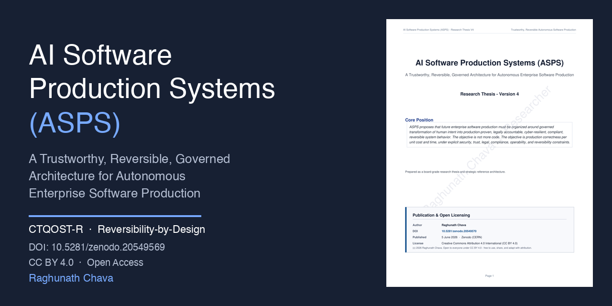
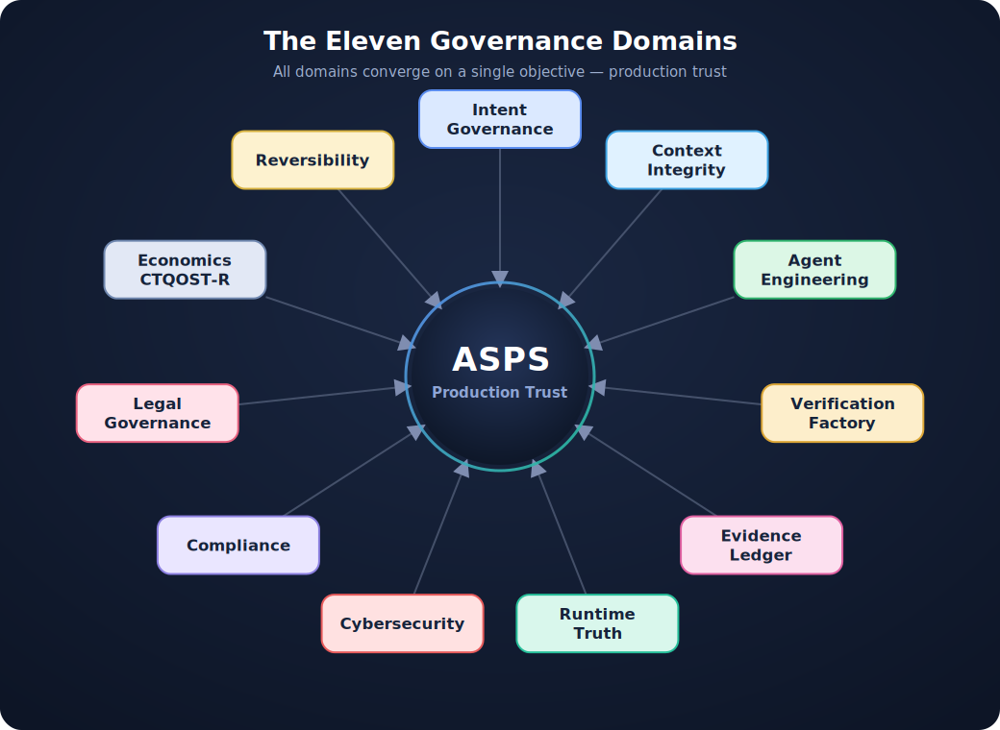

<div align="center">



# AI Software Production Systems (ASPS)

### A Trustworthy, Reversible, Governed Architecture for Autonomous Enterprise Software Production

*When AI agents stop assisting and start **producing**, the question is no longer “how fast can we ship?” — it is “can we prove, govern, and reverse what autonomy puts into production?”*

<br/>

[](https://doi.org/10.5281/zenodo.20549569)
[](https://creativecommons.org/licenses/by/4.0/)
[-1f3b73?style=for-the-badge)](https://doi.org/10.5281/zenodo.20549570)

[](#)
[](#)
[](#)
[](#)

**[📄 Read the Thesis](ASPS_Research_Thesis_V4_Final.pdf)** · **[🔗 Cite via DOI](https://doi.org/10.5281/zenodo.20549569)** · **[🧭 Framework Domains](#-the-eleven-governance-domains)** · **[🗺️ Maturity Model](#️-the-asps-maturity-model)**

</div>

---

## 📌 Core Position

> **ASPS proposes that future enterprise software production must be organized around the *governed transformation of human intent* into production-proven, legally accountable, cyber-resilient, compliant, and reversible system behavior.**
>
> The objective is not more code. The objective is **production correctness per unit cost and time**, under explicit constraints of security, trust, legal, compliance, operability, and reversibility.

As autonomous AI agents move from code assistants to **production actors**, the paradigms we rely on — SDLC, Agile, DevOps, GitOps, MLOps, Platform Engineering — leave critical gaps in **trust, reversibility, and accountability**. ASPS is a board-grade reference architecture designed to close those gaps *before* autonomy outpaces our ability to govern it.

---

## 🧠 Two Core Contributions

### 1. The CTQOST-R Optimization Model

Traditional delivery optimizes **Cost, Time, Quality**. Autonomous production demands more. CTQOST-R reframes success as *correctness under constraint*:

| Dimension | Meaning |
|-----------|---------|
| **C** — Cost | Total economic cost of production |
| **T** — Time | Velocity to production-proven outcome |
| **Q** — Quality | Correctness, architecture integrity, defect resistance |
| **O** — Operability | Observability, SLOs, incident readiness, scaling |
| **S** — Security | Cyber resilience across the autonomous attack surface |
| **T** — Trust | Evidence, accountability, governance assurance |
| **R** — **Reversibility** | The ability to undo, compensate, contain, or safely degrade |

> ASPS does not optimize speed alone. It optimizes **production-correct outcomes** under economic, operational, security, trust, and reversal constraints.

### 2. Reversibility-by-Design

> **Invariant:** *No autonomous action is promotable to production unless its reversal, compensation, containment, or safe-degradation path is defined in advance.*

Reversibility is elevated from an afterthought to a **first-class engineering invariant** — verified through rollback simulation, compensation testing, snapshot validation, forensic replay, and safe-degradation checks.

---

## 🧭 The Eleven Governance Domains

ASPS organizes autonomous production into eleven interdependent domains, all converging on a single objective: **production trust**. A weak domain lowers the trustworthiness of the entire system.

<div align="center">
  
</div>

| Domain | Primary Output |
|--------|----------------|
| **Intent Governance** | Intent Contracts, assumptions, exclusions, risk classification |
| **Context Integrity** | Production Knowledge Graph, context trust scoring |
| **Agent Engineering** | Agent registry, skill catalog, tool-trust registry |
| **Verification Factory** | Test, conformance & resilience evidence |
| **Evidence Ledger** | Signed proof of *why* a change was promoted |
| **Runtime Truth** | Telemetry that proves or disproves delivery claims |
| **Cyber Production Security** | Threat model, policy enforcement, supply-chain attestation |
| **Autonomous Compliance** | Compliance evidence, drift signals, control attestation |
| **Legal Governance** | Accountability chain, legal-risk register, signed evidence |
| **Production Economics** | Cost-of-production intelligence under CTQOST-R |
| **Reversibility** | Release decision, rollback contract, approval trail |

---

## 🗺️ The ASPS Maturity Model

A self-assessment ladder for organizations adopting autonomous production — each level paired with the **question a board should be able to answer**.

| Level | Name | The Board Question |
|:---:|------|--------------------|
| **0** | Manual / fragmented delivery | *Do we know how production changes are proven?* |
| **1** | AI-assisted engineering | *Are we creating faster, unmanaged risk?* |
| **2** | Governed agent workflows | *Which agents can affect production?* |
| **3** | Evidence-led production | *Can we audit why a change was promoted?* |
| **4** | Runtime-truth adaptive production | *Does production prove or disprove delivery claims?* |
| **5** | Trustworthy reversible autonomous production | *Can the enterprise safely scale autonomous production?* |

---

## 📚 What's Inside the Thesis (31 Sections)

<table>
<tr><td valign="top">

**Foundations**
1. Introduction
2. Research Problem
3. Core Thesis
4. Differentiation from Existing Paradigms
5. ASPS Framework Domains
6. Foundational Principles

**Production Machinery**
7. Intent Contracts
8. Agent Engineering Framework
9. Agent Lifecycle Governance
10. Reference Production Cell Catalog

**Trust & Control Plane**
11. Cyber Production Security
12. Autonomous Compliance Engineering
13. Legal Production Governance
14. Reversibility-by-Design

</td><td valign="top">

**Evidence & Truth**
15. Production Knowledge Graph & Context Lifecycle
16. Verification Factory
17. Evidence Ledger
18. Runtime Truth Validation
19. Formal Metrics
20. Production Economics
21. Human Accountability & Operating Model

**Architecture & Adoption**
22. Reference Architecture
23. Standards & Framework Mapping
24. ASPS Maturity Model
25. ASPS Anti-Patterns
26. End-to-End ASPS Walkthrough
27. Research Validation Strategy
28. Adoption Roadmap
29. Board & Executive Governance
30. Limitations & Boundary Conditions
31. Research Contribution

</td></tr>
</table>

---

## 🏛️ Reference Architecture (Vendor-Neutral)

ASPS is defined by **control responsibilities, not products** — implementable across any cloud, model provider, CI/CD stack, observability platform, or GRC system.

| Layer | Core Capability |
|-------|-----------------|
| **Experience Layer** | Conversational intake, intent negotiation, risk clarification |
| **Intent Layer** | Intent Contracts, exclusions, risk classification, success telemetry |
| **Governance Layer** | Policy-as-code, agent trust classes, compliance controls, approval thresholds |
| **Context Layer** | Production Knowledge Graph, source trust, memory partitions, retrieval policies |
| **Orchestration Layer** | Cell routing, task decomposition, sub-agent spawning, escalation |

---

## 🚫 ASPS Anti-Patterns

Things the framework explicitly warns against:

- **AI code factory without verification** — maximizes output while hiding defects and architecture drift
- Autonomous action without a defined reversal path
- Agents with unscoped tool access or unversioned context
- Promotion without signed evidence
- Velocity treated as success while runtime truth goes unmeasured

---

## 📖 How to Cite

If you use or build on ASPS, please cite it:

> Chava, R. (2026). *AI Software Production Systems (ASPS) — Research V4* (Version v4). Zenodo. https://doi.org/10.5281/zenodo.20549569

<details>
<summary><b>BibTeX</b></summary>

```bibtex
@techreport{chava2026asps,
  author      = {Chava, Raghunath},
  title       = {{AI Software Production Systems (ASPS) --- Research V4}},
  year        = {2026},
  month       = jun,
  publisher   = {Zenodo},
  version     = {v4},
  doi         = {10.5281/zenodo.20549569},
  url         = {https://doi.org/10.5281/zenodo.20549569},
  note        = {Concept DOI --- always resolves to the latest version}
}
```
</details>

<details>
<summary><b>CITATION.cff</b></summary>

```yaml
cff-version: 1.2.0
message: "If you use ASPS, please cite it as below."
title: "AI Software Production Systems (ASPS) — Research V4"
authors:
  - family-names: Chava
    given-names: Raghunath
version: v4
date-released: 2026-06-05
doi: 10.5281/zenodo.20549569
license: CC-BY-4.0
type: report
```
</details>

> 💡 Use the **Concept DOI** `10.5281/zenodo.20549569` for general citation (always resolves to the latest version). Use the **Version DOI** `10.5281/zenodo.20549570` to reference v4 specifically.

---

## 🤝 Contributing & Discussion

ASPS is an open research framework — critique makes it stronger.

- **Found a gap, flaw, or counter-example?** Open an [Issue](../../issues).
- **Have a refinement or case study?** Start a [Discussion](../../discussions) or open a Pull Request.
- **Adopting ASPS in your org?** I'd love to hear where it holds and where it breaks.

The goal is a framework the industry debates *before* autonomy outpaces governance — not after.

---

## 📄 License

This work is licensed under the **[Creative Commons Attribution 4.0 International (CC BY 4.0)](https://creativecommons.org/licenses/by/4.0/)** license.

You are free to **share** and **adapt** the material for any purpose, even commercially — provided you give **appropriate credit** to Raghunath Chava and indicate if changes were made.

© 2026 Raghunath Chava. Open to everyone.

---

<div align="center">

**AI Software Production Systems (ASPS)**
*Production trust, by design.*

Authored by **Raghunath Chava** · Principal Architect & AI Research Scientist

[](https://doi.org/10.5281/zenodo.20549569)
[](https://creativecommons.org/licenses/by/4.0/)

⭐ *If ASPS sparks an idea, star the repo and share the DOI.*

</div>
